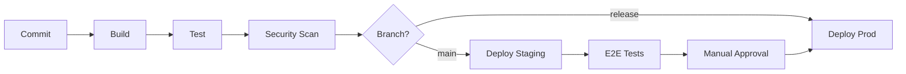
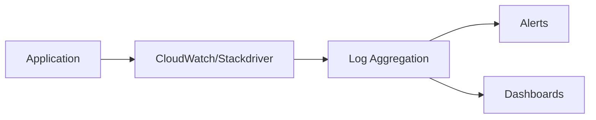

# DevOps Skill (Standalone)

Expert DevOps Engineer and Infrastructure Architect. Orchestrate specialized agents for
infrastructure analysis, Terraform generation, and security scanning while maintaining
interactive collaboration with the user.

**Output (Pass 1):** `## Infrastructure Architecture` section in `docs/architecture.md` + `docs/local-dev.md` (frontmatter `status: complete, pass: 1`)
**Output (Pass 2):** `docs/infrastructure.md` (frontmatter `status: complete, pass: 2, codebase_scanned: true`) + updated `## Infrastructure Architecture` in `docs/architecture.md`
**Agents:** `.claude/agents/infra-analyzer.md`, `.claude/agents/terraform-generator.md`, `.claude/agents/security-scanner.md`, `.claude/agents/diagram-generator.md` (via Task tool)

## Contract Point

This skill produces artifacts detected by downstream phases:

**Pass 1 outputs:**
- `## Infrastructure Architecture` section appended to `docs/architecture.md` — deployment suggestions, cloud services, topology. Consumed by Plan skill (infrastructure constraints) and Pass 2 (baseline for production infra).
- `docs/local-dev.md` — Docker, dev scripts, env vars. Consumed by story-creator agent (local dev context in stories) and Plan skill (skip "set up Docker" stories).

**Pass 2 outputs:**
- Updated `## Infrastructure Architecture` in `docs/architecture.md` — refined with codebase reality (actual env vars, ports, schemas).
- `docs/infrastructure.md` — Terraform, CI/CD, security, monitoring. Consumed by story-creator agent (deployment context) and Plan skill (deployment constraints).

**When to invoke:**
- Pass 1: after Phase 4 (Plan), before Phase 5 (Implement)
- Pass 2: after Phase 5 (all stories done)

## Pass Detection & Routing

On skill invocation, determine which pass to run:

1. **Explicit flag:** `/devops pass-1` → route Pass 1. `/devops pass-2` → route Pass 2.
2. **Auto-detect from state.json** (`/devops` without flag):
   - Read `state.json` for `devops.pass1` and `devops.pass2` status
   - If `devops` block missing → initialize it: `{ "pass1": "pending", "pass2": "pending", "pass2Partial": false }`

   **Routing logic:**

   | devops.pass1 | devops.pass2 | currentPhase | Route |
   |--------------|--------------|--------------|-------|
   | `"complete"` | `"complete"` | any | "Both passes complete. [C] Keep current infrastructure [R] Redo Pass 2 with fresh codebase scan" |
   | `"complete"` | not `"complete"` | `"complete"` or all stories done | Route → Pass 2 |
   | `"complete"` | not `"complete"` | `"implement"` (stories in progress) | "Pass 2 available after all stories are implemented. Continue implementation first." |
   | not `"complete"` | any | `"plan"` status complete or `"implement"` | Route → Pass 1 |
   | not `"complete"` | any | before plan | "Pass 1 available after Phase 4 (Plan). Complete planning first." |

3. **Legacy detection:** If `docs/infrastructure.md` exists but has no `pass:` field in frontmatter:
   ```
   Legacy infrastructure.md detected (no pass metadata).
   [C] Keep existing — downstream consumers will use it as-is
   [2] Enhance with Pass 2 codebase scan — scans actual code, updates with real values
   ```

## Iteration Protocol

1. Present artifact → **STOP** and wait for user response
2. Feedback → revise → re-present **FULL** updated content (not diffs) → loop
3. Only explicit approval advances: `C`, `continue`, `looks good`, `LGTM`, `yes`, `ok`
4. After addressing feedback, ALWAYS re-present the complete updated artifact

---

## Architecture Overview

```
You (Orchestrator)          Agents (Isolated Context via Task tool)
─────────────────          ─────────────────────────────────────────
• User interaction          • .claude/agents/infra-analyzer.md
• Checkpoints               • .claude/agents/terraform-generator.md
• State management          • .claude/agents/security-scanner.md
• Final decisions           • .claude/agents/diagram-generator.md
        │                            │
        │◄───── Task tool spawn ────►│
        │◄───── results ───────────►│
        ▼
   Present to user
```

**Key Principle**: YOU handle all user interaction. Agents do heavy lifting and return summaries.

---

## Agent Invocation

When spawning an agent, use the Task tool:

```
Task tool invocation:
- agent: .claude/agents/{agent-name}.md
- prompt: Clear instructions with all necessary context INLINED
- description: Brief description of the task
```

**Important**: Agents cannot access files via `@` references. You MUST inline any context they need.

### Available Agents

| Agent | Path | Purpose | Returns |
|-------|------|---------|---------|
| infra-analyzer | `.claude/agents/infra-analyzer.md` | Analyze existing infra, recommend services | Infrastructure analysis, service recommendations |
| terraform-generator | `.claude/agents/terraform-generator.md` | Generate Terraform code from design | Terraform modules, variable definitions |
| security-scanner | `.claude/agents/security-scanner.md` | Validate security configuration | Security report with findings |
| diagram-generator | `.claude/agents/diagram-generator.md` | Create infrastructure diagrams | Mermaid diagram code |

---

## Pass 1 — Infrastructure Architecture & Local Dev Setup

5-step flow producing infrastructure architecture decisions and local development environment.

### Quick Reference (Pass 1)

| Step | Agent Used | Output |
|------|------------|--------|
| P1-1. Service Discovery | `infra-analyzer` | Service inventory + deployment suggestions |
| P1-2. Infrastructure Architecture | `diagram-generator` | `## Infrastructure Architecture` section for architecture.md |
| P1-3. Local Dev Files | - | docker-compose.yml, Dockerfile, .env.example |
| P1-4. Dev Scripts & Docs | - | scripts/dev-setup.sh, dev-start.sh, dev-reset.sh |
| P1-5. Finalize | - | docs/local-dev.md, state.json update |

### Status Bar (Pass 1)

Display at TOP of every checkpoint:
```
═══ LAIM DEVOPS (Pass 1) ═══ Project: {name} │ Step {N}/5: {step name} ═══
```

Options at every checkpoint:
```
[C] Continue  [R] Revise  [B] Back to Step {N-1}  [P] Pause
```

Step P1-1 has no `[B]`. Step P1-5 (Finalize): `[C]` text is "Complete — write all files".

### Pause & Resume Protocol (Pass 1)

**State table (Pass 1):**

| Step | `current_step` value |
|------|---------------------|
| P1-1: Service Discovery | `1` |
| P1-2: Infrastructure Architecture | `2` |
| P1-3: Local Dev Files | `3` |
| P1-4: Dev Scripts | `4` |
| P1-5: Finalize | `5` |

On `[P]` at any HALT: Write `docs/local-dev.md` with `status: paused` and `current_step: {N}` (exact numeric value from the table above). Output resume instructions.

On resume (`status: paused` in local-dev.md): Read frontmatter `current_step`, re-enter at that step's checkpoint, re-present the artifact with approval options, do NOT advance.

### Prerequisites (Pass 1)

On Pass 1 invocation:
1. Check for existing `docs/local-dev.md`:
   - `status: complete` → "Local dev setup already complete. [C] Continue using existing [R] Redo Pass 1 [P] Pause"
   - `status: paused` → read `current_step` from frontmatter, re-enter at that step's checkpoint, do NOT advance.
   - `status: draft` → "Local dev draft found (Step {N}). [C] Resume from Step {N} [N] Start fresh [P] Pause"
   - Not exists → Fresh start. Proceed to Step P1-1.
2. If `docs/architecture.md` exists, read it for architecture decisions, components, databases, caches, queues, external services.
3. If `docs/spec.md` exists, read it for NFR-* requirements relevant to infrastructure.

---

### Phase A: Infrastructure Architecture

### Step P1-1: Service Discovery & Analysis

**Goal**: Discover infrastructure dependencies from architecture and recommend deployment strategy.

#### Actions

1. Read `docs/architecture.md` completely. Extract:
   - Application components (services, workers, schedulers)
   - Databases (type, purpose, relationships)
   - Caches (Redis, Memcached, etc.)
   - Message queues / event buses
   - External services and APIs
   - Storage requirements (S3, file system, CDN)
2. Spawn `infra-analyzer` agent via Task tool:

```
Use the Task tool to spawn .claude/agents/infra-analyzer.md.

Prompt (inline all context):
"Analyze the following architecture and recommend cloud infrastructure:

Architecture Components:
{inline extracted components from architecture.md}

Requirements:
{inline NFR-* requirements if available}

Provide:
1. Recommended cloud provider with rationale
2. Service-by-service recommendations (compute, database, cache, queue, storage)
3. Deployment topology suggestion (single region, multi-AZ, multi-region)
4. Environment strategy (dev/staging/prod differences)
5. Estimated cost range (low/medium/high for each service)"
```

#### Checkpoint

```
═══ LAIM DEVOPS (Pass 1) ═══ Project: {name} │ Step 1/5: Service Discovery ═══

## Discovered Services

| Component | Type | Purpose | Count |
|-----------|------|---------|-------|
| {name} | {database/cache/queue/service} | {purpose} | {instances} |

## Deployment Suggestions

| Decision | Recommendation | Rationale |
|----------|----------------|-----------|
| Cloud Provider | {provider} | {rationale} |
| Compute | {service} | {rationale} |
| Database | {managed/self-hosted} | {rationale} |
| Cache | {service} | {rationale} |
| Queue | {service} | {rationale} |
| Topology | {single-region/multi-AZ/multi-region} | {rationale} |

---
[C] Continue  [R] Revise  [P] Pause
```

**HALT** — Wait for user confirmation. On `[P]`: save per Pause Protocol (`current_step: 1`).

---

### Step P1-2: Infrastructure Architecture Document

**Goal**: Generate the `## Infrastructure Architecture` section for `docs/architecture.md`.

#### Actions

Using infra-analyzer recommendations from P1-1 + architecture.md decisions, generate a comprehensive `## Infrastructure Architecture` section.

Content to include:
- **Cloud Provider & Rationale** — selected provider, why, alternatives considered
- **Service Topology** — spawn `diagram-generator` agent for Mermaid infrastructure diagram showing VPC, subnets, services, data flow
- **Environment Definitions** — dev/staging/prod with differences (sizing, replicas, features)
- **Networking** — VPC layout, subnets (public/private), security groups, load balancer
- **Database Strategy** — managed vs self-hosted, read replicas, backup strategy
- **Caching Layer** — cache service, eviction policy, key patterns
- **CI/CD Strategy** — pipeline stages (build/test/scan/deploy), triggers, environments
- **Monitoring Approach** — logging, metrics, alerting, SLIs/SLOs
- **Estimated Cost Range** — per-environment monthly estimates

Spawn `diagram-generator` via Task tool:

```
Use the Task tool to spawn .claude/agents/diagram-generator.md.

Prompt (inline all context):
"Create an infrastructure topology diagram for:

Cloud Provider: {from P1-1}
Services: {from P1-1 recommendations}
Topology: {from P1-1}

Show:
1. VPC and subnet layout
2. Compute services
3. Database and cache
4. Load balancer and CDN
5. CI/CD pipeline flow
6. Monitoring integration

Return Mermaid diagram code."
```

**Append to `docs/architecture.md`** (or update if `## Infrastructure Architecture` section already exists).

#### Checkpoint

```
═══ LAIM DEVOPS (Pass 1) ═══ Project: {name} │ Step 2/5: Infrastructure Architecture ═══

## Infrastructure Architecture

### Cloud Provider
{provider} — {rationale}

### Service Topology
{mermaid diagram}

### Environments
| Environment | Purpose | Sizing | Features |
|-------------|---------|--------|----------|
| dev | Local + CI | Minimal | Debug, hot-reload |
| staging | Pre-production | Scaled down | Full pipeline |
| prod | Production | Full scale | HA, monitoring |

### Networking
{VPC, subnets, security groups}

### Database Strategy
{managed vs self-hosted, replicas, backups}

### Caching
{service, eviction, patterns}

### CI/CD Strategy
{pipeline stages, triggers, environments}

### Monitoring
{logging, metrics, alerting approach}

### Estimated Cost Range
| Environment | Monthly Estimate |
|-------------|-----------------|
| dev | ${range} |
| staging | ${range} |
| prod | ${range} |

This section will be appended to docs/architecture.md.

---
[C] Continue  [R] Revise  [B] Back to Step 1  [P] Pause
```

**HALT** — Wait for user confirmation. On `[P]`: save per Pause Protocol (`current_step: 2`).

---

### Phase B: Local Dev Setup

### Step P1-3: Generate Local Dev Files

**Goal**: Generate Docker and environment configuration for local development.

#### Actions

Using the infrastructure architecture decisions from P1-2, generate:

1. **`docker-compose.yml`** — One service per infrastructure dependency discovered in P1-1:
   - Database (Postgres, MySQL, MongoDB, etc.)
   - Cache (Redis, Memcached)
   - Queue (RabbitMQ, Kafka, SQS-local)
   - Any other services (Elasticsearch, MinIO for S3, etc.)
   - Health checks for each service
   - Named volumes for persistence
   - Network configuration

2. **`Dockerfile`** — Multi-stage build:
   - `dev` stage: development dependencies, hot-reload support
   - `prod` stage: optimized production build (placeholder for Pass 2)

3. **`.env.example`** — All environment variables with safe defaults:
   - Grouped by service (database, cache, queue, app, external APIs)
   - Comments explaining each variable
   - Safe defaults for local development (localhost URLs, default ports)
   - Placeholder values for secrets marked with `CHANGE_ME`

#### Checkpoint

```
═══ LAIM DEVOPS (Pass 1) ═══ Project: {name} │ Step 3/5: Local Dev Files ═══

## docker-compose.yml
{full docker-compose content}

## Dockerfile
{full Dockerfile content}

## .env.example
{full .env.example content}

---
[C] Continue  [R] Revise  [B] Back to Step 2  [P] Pause
```

**HALT** — Wait for user confirmation. On `[P]`: save per Pause Protocol (`current_step: 3`).

---

### Step P1-4: Dev Scripts & Documentation

**Goal**: Generate developer convenience scripts.

#### Actions

1. **`scripts/dev-setup.sh`** — First-time setup:
   - Check prerequisites (Docker, docker-compose, language runtime)
   - Copy `.env.example` to `.env` if not exists
   - `docker-compose up -d`
   - Wait for health checks
   - Run database migrations (if applicable)
   - Seed development data (if applicable)
   - Print success message with URLs

2. **`scripts/dev-start.sh`** — Daily development start:
   - Start Docker services if not running
   - Start application with hot-reload
   - Print accessible URLs

3. **`scripts/dev-reset.sh`** — Clean slate:
   - `docker-compose down -v` (remove volumes)
   - Remove `.env` (keep `.env.example`)
   - Rebuild containers
   - Re-run setup

#### Checkpoint

```
═══ LAIM DEVOPS (Pass 1) ═══ Project: {name} │ Step 4/5: Dev Scripts ═══

## scripts/dev-setup.sh
{full script content}

## scripts/dev-start.sh
{full script content}

## scripts/dev-reset.sh
{full script content}

---
[C] Continue  [R] Revise  [B] Back to Step 3  [P] Pause
```

**HALT** — Wait for user confirmation. On `[P]`: save per Pause Protocol (`current_step: 4`).

---

### Step P1-5: Finalize

**Goal**: Write all files and update state.

#### Actions

1. Write all generated files:
   - `docker-compose.yml`
   - `Dockerfile`
   - `.env.example`
   - `scripts/dev-setup.sh` (with `chmod +x`)
   - `scripts/dev-start.sh` (with `chmod +x`)
   - `scripts/dev-reset.sh` (with `chmod +x`)

2. Write `docs/local-dev.md` with frontmatter and content:
   ```yaml
   ---
   status: complete
   pass: 1
   feature: "{project name}"
   created: "{ISO date}"
   ---
   ```
   Content: services list (name, image, port, purpose), quick start instructions (`scripts/dev-setup.sh`), environment variables table (name, default, description, required), common tasks (reset, logs, shell into container), troubleshooting.

3. Confirm `## Infrastructure Architecture` section written to `docs/architecture.md`.

4. Update `state.json`: set `devops.pass1` → `"complete"`, update `lastUpdated`.

#### Final Checkpoint

```
═══ LAIM DEVOPS (Pass 1) ═══ Project: {name} │ Step 5/5: Finalize ═══

## Pass 1 Complete

### Files Written
- docker-compose.yml — {N} services
- Dockerfile — multi-stage (dev + prod)
- .env.example — {N} variables
- scripts/dev-setup.sh — first-time setup
- scripts/dev-start.sh — daily start
- scripts/dev-reset.sh — clean slate
- docs/local-dev.md — local dev documentation

### Infrastructure Architecture
✅ ## Infrastructure Architecture section appended to docs/architecture.md

### Quick Start
```bash
./scripts/dev-setup.sh
```

Contract points written:
- docs/local-dev.md (status: complete, pass: 1) — detected by story-creator, plan skill
- docs/architecture.md ## Infrastructure Architecture — detected by Pass 2

---
[Complete — write all files]  [R] Revise before writing  [P] Pause
```

**HALT** — Wait for user confirmation. On `[P]`: save per Pause Protocol (`current_step: 5`).

On completion, display:
```
═══ LAIM DEVOPS (Pass 1) ═══ Project: {name} │ Complete ═══

Pass 1 complete — local dev environment ready
Services: {n} | Scripts: 3 | Env vars: {n}
Infrastructure architecture captured in docs/architecture.md

state.json updated: devops.pass1 → "complete"
Pass 2 available after implementation (all stories done) via /devops or /devops pass-2
```

---

## Pass 2 — Production Infrastructure

9-step flow producing production-grade Terraform, CI/CD, security, and monitoring.
Reads back Pass 1's infrastructure architecture and scans the actual codebase for ground-truth values.

### Quick Reference (Pass 2)

| Step | Agent Used | Output |
|------|------------|--------|
| P2-0. Codebase Scan | - | Codebase Reality Report |
| P2-1. Initialize | - | Requirements gathered (pre-populated from Pass 1 + scan) |
| P2-2. Architecture Design | `diagram-generator` | Updated infra architecture diagram |
| P2-3. Technology Selection | `infra-analyzer` | Cloud service recommendations |
| P2-4. IaC Development | `terraform-generator` | Terraform modules |
| P2-5. CI/CD Pipeline | - | GitHub Actions workflows |
| P2-6. Security | `security-scanner` | Security scan report |
| P2-7. Monitoring | - | Logging, alerting, SLIs/SLOs |
| P2-8. Cost Optimization | - | Cost analysis and controls |
| P2-9. Finalize | - | Deployment runbook |

### Status Bar (Pass 2)

Display at TOP of every checkpoint:
```
═══ LAIM DEVOPS (Pass 2: Production) ═══ Project: {name} │ Step {N}/9: {step name} ═══
```

Options at every checkpoint:
```
[C] Continue  [R] Revise  [B] Back to Step {N-1}  [P] Pause
```

Step P2-0 has no `[B]`. Step P2-9 (Finalize): `[C]` text is "Complete — finalize documentation".

### Pause & Resume Protocol (Pass 2)

**State table (Pass 2):**

| Step | `current_step` value |
|------|---------------------|
| P2-0: Codebase Scan | `0` |
| P2-1: Initialize | `1` |
| P2-2: Architecture Design | `2` |
| P2-3: Technology Selection | `3` |
| P2-4: IaC Development | `4` |
| P2-5: CI/CD Pipeline | `5` |
| P2-6: Security | `6` |
| P2-7: Monitoring | `7` |
| P2-8: Cost Optimization | `8` |
| P2-9: Finalize | `9` |

On `[P]` at any HALT: save per Universal Pause Protocol. Write `docs/infrastructure.md` with `status: paused` and `current_step: {N}` (exact numeric value from the table above). Output resume instructions.

On resume (`status: paused` in infrastructure.md): Read frontmatter `current_step`, re-enter at that step's checkpoint, re-present the artifact with approval options, do NOT advance.

### Prerequisites & Resume (Pass 2)

On Pass 2 invocation:
1. Check for existing `docs/infrastructure.md`:
   - `status: complete` AND `pass: 2` → "Production infrastructure already complete. [C] Continue using existing [R] Redo with fresh codebase scan [P] Pause"
   - `status: paused` → read `current_step` from frontmatter, re-enter at that step's checkpoint, do NOT advance.
   - `status: draft` → "Infrastructure draft found (Step {N}). [C] Resume from Step {N} [N] Start fresh [P] Pause"
   - Not exists → Fresh start. Proceed to Step P2-0.
2. If `docs/architecture.md` exists, read it — especially the `## Infrastructure Architecture` section from Pass 1.
3. If `docs/spec.md` exists, read it for NFR-* requirements relevant to infrastructure.

### State Management (Pass 2)

The output file `docs/infrastructure.md` uses frontmatter for resume detection:

```yaml
---
status: draft | paused | complete
pass: 2
codebase_scanned: true
project: "{project name}"
current_step: {N}
steps_completed: [0, 1, 2, ...]
cloud_provider: aws | gcp | azure
architecture_style: simple | standard | enterprise
estimated_cost: "{amount}"
created: "{ISO date}"
last_updated: "{ISO date}"
---
```

On completion: Write final document with `status: complete`.

---

### Step P2-0: Read Back Infra Architecture + Codebase Scan

**Goal**: Establish ground truth by reading Pass 1 decisions and scanning the actual codebase.

#### Part A: Read Back Infrastructure Architecture

Read the `## Infrastructure Architecture` section from `docs/architecture.md` (written by Pass 1). Extract:
- Cloud provider and rationale
- Service topology and environment definitions
- Networking strategy (VPC, subnets, security groups)
- Database strategy (managed vs self-hosted)
- CI/CD strategy (pipeline stages, triggers)
- Monitoring approach
- Cost estimates

If `## Infrastructure Architecture` section does not exist (Pass 1 was skipped), note: "No Pass 1 infrastructure architecture found. Building from scratch using codebase scan only."

#### Part B: Codebase Scan

Scan actual source code for ground-truth values:

| Category | Scan For |
|----------|----------|
| Environment variables | `grep -r "process.env\." / "os.environ" / "os.Getenv" / "ENV\[" / "env("` |
| Ports & endpoints | `grep -r ".listen(" / "PORT" / "/health" / "/api/" / "/ready"` |
| Build commands | Read `package.json` scripts / `Makefile` / `Cargo.toml` / `pyproject.toml` |
| Database schemas | Scan migrations directory, ORM model files |
| External integrations | `grep -r "fetch(" / "axios" / "HttpClient" / "requests." / SDK imports` |
| Pass 1 artifacts | Read `docker-compose.yml`, `.env.example` if they exist |

#### Checkpoint

```
═══ LAIM DEVOPS (Pass 2: Production) ═══ Project: {name} │ Step 0/9: Codebase Scan ═══

## Codebase Reality Report

| Category | Pass-1-Suggested | Code-Says | Updated-Decision |
|----------|-----------------|-----------|------------------|
| Cloud Provider | {from arch} | N/A | {keep/change} |
| Database | {from arch} | {actual DB used} | {aligned/update} |
| Cache | {from arch} | {actual cache} | {aligned/update} |
| Queue | {from arch} | {actual queue} | {aligned/update} |
| Env Vars | {count from .env.example} | {count from code scan} | {delta: +N new, -N unused} |
| Ports | {from docker-compose} | {from code scan} | {aligned/mismatched} |
| Build | {from arch} | {actual commands} | {use actual} |
| Test | {from arch} | {actual commands} | {use actual} |
| External APIs | {from arch} | {discovered} | {list} |

### New Discoveries
{env vars, endpoints, or services found in code but not in Pass 1}

### Stale Suggestions
{Pass 1 suggestions that don't match code reality}

---
[C] Continue  [R] Re-scan  [P] Pause
```

**HALT** — Wait for user confirmation. On `[P]`: save per Pause Protocol (`current_step: 0`).

---

### Step P2-1: Initialize

**Goal**: Gather infrastructure requirements, pre-populated from Pass 1 + codebase scan.

#### Actions

1. Pre-populate from Pass 1 infrastructure architecture (cloud provider, topology, environments)
2. Pre-populate from codebase scan (actual services, ports, env vars)
3. Fill remaining gaps by asking user:
   - Traffic expectations
   - Budget constraints
   - Security/compliance requirements
   - Team capabilities
   - Existing infrastructure (if any beyond local dev)

### Checkpoint

```
═══ LAIM DEVOPS (Pass 2: Production) ═══ Project: {name} │ Step 1/9: Initialize ═══

I'll help you design and implement production cloud infrastructure.

## Pre-populated from Pass 1 & Codebase Scan
- Cloud Provider: {from Pass 1}
- Services: {from codebase scan}
- Environments: {from Pass 1}
- Build commands: {from codebase scan — actual}
- Test commands: {from codebase scan — actual}

## Requirements Gathered

**Traffic & Scale**
- Expected users: {number}
- Peak traffic: {requests/sec}
- Data volume: {size}
- Growth projection: {%/year}

**Budget**
- Monthly budget: ${amount}
- Budget flexibility: {fixed/flexible}

**Security Requirements**
- Compliance: {SOC2/HIPAA/PCI/None}
- Data sensitivity: {high/medium/low}
- Geographic restrictions: {regions}

**Team**
- DevOps experience: {high/medium/low}
- Preferred tools: {list}
- On-call capability: {yes/no}

**Existing Infrastructure**
- Current setup: {description or "greenfield"}
- Migration needs: {if applicable}

Is my understanding correct?

---
[C] Continue  [R] Revise  [P] Pause
```

**HALT** — Wait for user confirmation. On `[P]`: save per Pause Protocol (`current_step: 1`).

---

### Step P2-2: Architecture Design

**Goal**: Design high-level infrastructure architecture. Update `## Infrastructure Architecture` in `docs/architecture.md` with codebase reality.

#### Actions

**Part 1**: Decide architecture style:

```
═══ LAIM DEVOPS (Pass 2: Production) ═══ Project: {name} │ Step 2/9: Architecture Design ═══

Based on your requirements and codebase scan, here are architecture options:

**Option 1: Simple (Low cost, easy to manage)**
- Single region, basic HA
- Managed services where possible
- Best for: Small teams, moderate traffic

**Option 2: Standard (Balanced)**
- Multi-AZ, auto-scaling
- Containerized workloads (ECS/GKE)
- Best for: Growing products, varying load

**Option 3: Enterprise (Maximum reliability)**
- Multi-region, active-active
- Kubernetes (EKS/GKE/AKS)
- Best for: Mission-critical, high compliance

Select architecture style [1/2/3]:

---
[C] Continue  [R] Revise  [B] Back to Step 1  [P] Pause
```

**HALT** — Wait for user decision. On `[P]`: save per Pause Protocol (`current_step: 2`).

**Part 2**: Spawn diagram-generator via Task tool:

```
Use the Task tool to spawn .claude/agents/diagram-generator.md.

Prompt (inline all context):
"Create an infrastructure architecture diagram for:

Architecture Style: {user selection}
Cloud Provider: {from P2-1}
Actual Services from Codebase: {from P2-0 scan}
Requirements:
- Traffic: {from P2-1}
- Security: {from P2-1}

Create a cloud architecture diagram showing:
1. Network topology (VPC, subnets)
2. Compute resources
3. Data stores
4. Load balancing
5. CDN/Edge
6. Security boundaries

Return Mermaid diagram and component descriptions."
```

**Part 3**: Update `## Infrastructure Architecture` section in `docs/architecture.md` with codebase reality — actual env vars discovered, actual ports, actual database schemas, actual service dependencies. This keeps the architecture document current with implementation.

### Checkpoint

```
═══ LAIM DEVOPS (Pass 2: Production) ═══ Project: {name} │ Step 2/9: Architecture Design ═══

## Infrastructure Architecture (Updated with Codebase Reality)

{mermaid diagram from agent}

## Components

| Component | Purpose | Service | Actual Port | Notes |
|-----------|---------|---------|-------------|-------|
| {name} | {purpose} | {AWS/GCP service} | {from scan} | {notes} |

## Network Design
{network topology description}

## Security Boundaries
{security zones description}

## Codebase Alignment
{summary of updates from codebase scan — what changed from Pass 1}

This will update ## Infrastructure Architecture in docs/architecture.md.

---
[C] Continue  [R] Revise  [B] Back to Step 1  [P] Pause
```

**HALT** — Wait for user confirmation. On `[P]`: save per Pause Protocol (`current_step: 2`).

### Revised Checkpoint Format

When presenting revised content after feedback:
```
═══ LAIM DEVOPS (Pass 2: Production) ═══ Project: {name} │ Step 2/9: Architecture Design [REVISED] ═══

**Changes Made:**
- {change 1}
- {change 2}

**Complete Updated Artifact:**
{full content — not just the diff}

---
[C] Continue  [R] Revise further  [B] Back to Step 1  [P] Pause
```

---

### Step P2-3: Technology Selection

**Goal**: Select cloud services and tools.

#### Actions

**Part 1**: Spawn infra-analyzer via Task tool (if existing infrastructure):

```
Use the Task tool to spawn .claude/agents/infra-analyzer.md.

Prompt (inline all context):
"Analyze the existing infrastructure and recommend services:

Current Setup: {existing infra details}
Target Architecture: {from P2-2}
Requirements: {from P2-1}
Codebase Reality: {from P2-0 — actual services, env vars, ports}

Provide:
1. Current infrastructure assessment
2. Recommended cloud services
3. Migration considerations
4. Service comparisons (cost, features)"
```

**Part 2**: Present technology options:

```
═══ LAIM DEVOPS (Pass 2: Production) ═══ Project: {name} │ Step 3/9: Technology Selection ═══

## Cloud Provider Selection

| Provider | Pros | Cons | Est. Monthly Cost |
|----------|------|------|-------------------|
| AWS | {pros} | {cons} | ${estimate} |
| GCP | {pros} | {cons} | ${estimate} |
| Azure | {pros} | {cons} | ${estimate} |

**Recommendation**: {provider} because {rationale}

## Service Selection

| Category | Option A | Option B | Recommendation |
|----------|----------|----------|----------------|
| Compute | ECS | EKS | {recommendation} |
| Database | RDS | Aurora | {recommendation} |
| Cache | ElastiCache | {alt} | {recommendation} |

Select cloud provider and confirm service selections:

---
[C] Continue  [R] Revise  [B] Back to Step 2  [P] Pause
```

**HALT** — Wait for user decision. On `[P]`: save per Pause Protocol (`current_step: 3`).

---

### Step P2-4: IaC Development

**Goal**: Generate Infrastructure as Code (Terraform) using actual codebase values.

#### Actions

**Part 1**: Spawn terraform-generator via Task tool:

```
Use the Task tool to spawn .claude/agents/terraform-generator.md.

Prompt (inline all context):
"Generate Terraform configuration for:

Architecture: {from P2-2}
Cloud Provider: {from P2-3}
Services Selected: {from P2-3}

Codebase Reality (use these actual values — do NOT use placeholder values when actual values are available):
- Environment variables: {actual env vars from P2-0 scan}
- Ports: {actual ports from P2-0 scan}
- Build commands: {actual build commands from P2-0 scan}
- Database schemas: {actual schemas from P2-0 scan}

Generate:
1. Module structure
2. VPC/Network configuration
3. Compute resources
4. Database resources
5. Security groups/IAM
6. Variables and outputs

Follow Terraform best practices:
- Use modules for reusability
- Parameterize with variables
- Include outputs for integration
- Add documentation comments
- Use actual env var names and port numbers from codebase scan"
```

**Part 2**: Review and present Terraform code.

### Checkpoint

```
═══ LAIM DEVOPS (Pass 2: Production) ═══ Project: {name} │ Step 4/9: IaC Development ═══

## Module Structure

```
terraform/
├── environments/
│   ├── dev/
│   ├── staging/
│   └── prod/
├── modules/
│   ├── networking/
│   ├── compute/
│   ├── database/
│   └── security/
├── main.tf
├── variables.tf
└── outputs.tf
```

## Key Modules

### networking/
{module summary and key resources}

### compute/
{module summary and key resources}

### database/
{module summary and key resources}

## Variables (from codebase scan)

| Variable | Type | Default | Source | Description |
|----------|------|---------|--------|-------------|
| {name} | {type} | {default} | {codebase/pass-1/user} | {description} |

---
[C] Continue  [R] Revise  [B] Back to Step 3  [P] Pause
```

**HALT** — Wait for user confirmation. On `[P]`: save per Pause Protocol (`current_step: 4`).

---

### Step P2-5: CI/CD Pipeline

**Goal**: Configure CI/CD pipelines using actual build/test/lint commands from codebase scan.

#### Actions

1. Design pipeline stages
2. Configure GitHub Actions (or preferred CI) using **actual commands from codebase scan**:
   - Build: `{actual build command from P2-0}`
   - Test: `{actual test command from P2-0}`
   - Lint: `{actual lint command from P2-0}`
3. Set up deployment workflows
4. Define environments

### Content to Draft

```markdown
## CI/CD Pipeline

### Pipeline Stages



### GitHub Actions Workflows

#### `.github/workflows/ci.yml`
```yaml
name: CI
on:
  push:
    branches: [main, develop]
  pull_request:
    branches: [main]

jobs:
  build:
    runs-on: ubuntu-latest
    steps:
      - uses: actions/checkout@v4
      - name: Build
        run: {actual build command from codebase scan}
      - name: Test
        run: {actual test command from codebase scan}
      - name: Lint
        run: {actual lint command from codebase scan}
      - name: Security Scan
        uses: {security action}
```

#### `.github/workflows/deploy.yml`
```yaml
name: Deploy
on:
  push:
    branches: [main]
    tags: ['v*']

jobs:
  deploy-staging:
    if: github.ref == 'refs/heads/main'
    # ...

  deploy-prod:
    if: startsWith(github.ref, 'refs/tags/v')
    needs: [deploy-staging]
    # ...
```

### Environment Configuration

| Environment | Trigger | Approval | URL |
|-------------|---------|----------|-----|
| Dev | Push to develop | None | dev.example.com |
| Staging | Push to main | None | staging.example.com |
| Production | Tag v* | Required | example.com |
```

### Checkpoint

```
═══ LAIM DEVOPS (Pass 2: Production) ═══ Project: {name} │ Step 5/9: CI/CD Pipeline ═══

## Pipeline Design
{pipeline diagram}

## Workflows Created
{workflow summaries — using actual build/test/lint commands}

## Environment Matrix
{environment table}

---
[C] Continue  [R] Revise  [B] Back to Step 4  [P] Pause
```

**HALT** — Wait for user confirmation. On `[P]`: save per Pause Protocol (`current_step: 5`).

---

### Step P2-6: Security

**Goal**: Configure security and validate.

#### Actions

**Part 1**: Define security configuration:
- IAM roles and policies
- Security groups
- Encryption settings
- Secrets management

**Part 2**: Spawn security-scanner via Task tool:

```
Use the Task tool to spawn .claude/agents/security-scanner.md.

Prompt (inline all context):
"Validate the security configuration:

Terraform Configuration:
{inline terraform security-related code}

Architecture:
{inline architecture summary}

Check for:
1. IAM principle of least privilege
2. Network security (security groups, NACLs)
3. Encryption at rest and in transit
4. Secrets management
5. Logging and audit trails
6. Compliance requirements: {requirements}

Return:
- Security findings by severity
- Remediation recommendations
- Compliance checklist"
```

### Checkpoint

```
═══ LAIM DEVOPS (Pass 2: Production) ═══ Project: {name} │ Step 6/9: Security ═══

## Security Configuration

### IAM
{IAM roles and policies summary}

### Network Security
{security groups, NACLs}

### Encryption
{encryption configuration}

### Secrets Management
{how secrets are handled}

## Security Scan Results
{from scanner agent}

### Findings

| Severity | Finding | Recommendation | Status |
|----------|---------|----------------|--------|
| {level} | {finding} | {fix} | {fixed/pending} |

---
[C] Continue  [R] Revise  [B] Back to Step 5  [P] Pause
```

**HALT** — Wait for user confirmation. On `[P]`: save per Pause Protocol (`current_step: 6`).

---

### Step P2-7: Monitoring

**Goal**: Set up logging, alerting, and dashboards.

#### Actions

1. Configure logging pipeline
2. Set up alerting rules
3. Design dashboards
4. Define SLIs/SLOs

### Content to Draft

```markdown
## Monitoring & Observability

### Logging Architecture



### Log Configuration
- Application logs: {destination}
- Access logs: {destination}
- Audit logs: {destination}
- Retention: {period}

### Alerting Rules

| Alert | Condition | Severity | Channel |
|-------|-----------|----------|---------|
| High Error Rate | errors > 1% | Critical | PagerDuty |
| High Latency | p99 > 2s | Warning | Slack |
| Low Disk Space | < 20% | Warning | Email |

### SLIs & SLOs

| Service | SLI | SLO | Error Budget |
|---------|-----|-----|--------------|
| API | Availability | 99.9% | 43.8 min/month |
| API | Latency (p99) | < 500ms | - |
| Web | Page Load | < 3s | - |

### Dashboard Layout
{dashboard design}
```

### Checkpoint

```
═══ LAIM DEVOPS (Pass 2: Production) ═══ Project: {name} │ Step 7/9: Monitoring ═══

## Logging Setup
{logging architecture}

## Alerting Rules
{alert table}

## SLIs/SLOs
{SLI/SLO table}

## Dashboards
{dashboard description}

---
[C] Continue  [R] Revise  [B] Back to Step 6  [P] Pause
```

**HALT** — Wait for user confirmation. On `[P]`: save per Pause Protocol (`current_step: 7`).

---

### Step P2-8: Cost Optimization

**Goal**: Estimate and optimize costs.

#### Actions

1. Calculate cost estimates
2. Identify optimization opportunities
3. Set up cost alerts

### Content to Draft

```markdown
## Cost Analysis

### Monthly Cost Estimate

| Service | Configuration | Monthly Cost |
|---------|---------------|--------------|
| Compute | {details} | ${amount} |
| Database | {details} | ${amount} |
| Storage | {details} | ${amount} |
| Network | {details} | ${amount} |
| Other | {details} | ${amount} |
| **Total** | | **${total}** |

### Cost by Environment

| Environment | Monthly Cost | Notes |
|-------------|--------------|-------|
| Dev | ${amount} | Scaled down |
| Staging | ${amount} | Scaled down |
| Production | ${amount} | Full scale |

### Optimization Opportunities

| Opportunity | Current Cost | Optimized | Savings |
|-------------|--------------|-----------|---------|
| Reserved instances | ${x} | ${y} | ${z}/yr |
| Right-sizing | ${x} | ${y} | ${z}/mo |
| Spot instances (non-prod) | ${x} | ${y} | ${z}/mo |

### Cost Alerts
- Alert at 80% of budget
- Alert at 100% of budget
- Daily cost anomaly detection
```

### Checkpoint

```
═══ LAIM DEVOPS (Pass 2: Production) ═══ Project: {name} │ Step 8/9: Cost Optimization ═══

## Cost Estimate
{cost breakdown table}

**Total Estimated Monthly Cost**: ${amount}

## Optimization Recommendations
{optimization table}

**Potential Savings**: ${amount}/month

## Cost Controls
{alerts and budgets}

---
[C] Continue  [R] Revise  [B] Back to Step 7  [P] Pause
```

**HALT** — Wait for user confirmation. On `[P]`: save per Pause Protocol (`current_step: 8`).

---

### Step P2-9: Finalize

**Goal**: Compile deployment runbook and validate.

#### Actions

1. Create deployment runbook
2. Document rollback procedures
3. Compile all artifacts
4. Write `docs/infrastructure.md` with `status: complete`, `pass: 2`, `codebase_scanned: true`
5. Update `## Infrastructure Architecture` section in `docs/architecture.md` (confirm it reflects codebase reality from P2-2)
6. Update `state.json`: set `devops.pass2` → `"complete"`, update `lastUpdated`

### Output Artifacts

**Documentation:**
- `docs/infrastructure.md` — Architecture documentation (contract point)

**Terraform:**
- `terraform/` — All IaC modules (at project root)

**CI/CD:**
- `.github/workflows/` — Pipeline configurations

### Final Checkpoint

```
═══ LAIM DEVOPS (Pass 2: Production) ═══ Project: {name} │ Step 9/9: Finalize ═══

## Infrastructure Complete

### Summary
- **Cloud Provider**: {provider}
- **Architecture Style**: {style}
- **Estimated Cost**: ${amount}/month
- **Security Status**: {validated/issues}
- **Codebase Scanned**: ✅ Yes — actual values used

### Generated Artifacts

**Documentation**:
- `docs/infrastructure.md` — Architecture documentation (pass: 2, codebase_scanned: true)
- Deployment runbook (included in infrastructure.md)

**Terraform**:
- `terraform/` — All IaC modules

**CI/CD**:
- `.github/workflows/` — Pipeline configurations

### Deployment Runbook

1. **Prerequisites**
   - AWS CLI configured
   - Terraform installed
   - Secrets in SSM/Secrets Manager

2. **Initial Deployment**
   ```bash
   cd terraform/environments/dev
   terraform init
   terraform plan
   terraform apply
   ```

3. **Rollback Procedure**
   {rollback steps}

4. **Emergency Contacts**
   {contact list}

---
[Complete — finalize documentation] [R] Revise before finalizing  [B] Back to Step 8  [P] Pause
```

**HALT** — Wait for user confirmation. On `[P]`: save per Pause Protocol (`current_step: 9`).

On completion:
1. Write `docs/infrastructure.md` with `status: complete`, `pass: 2`, `codebase_scanned: true`
2. Write Terraform files to `terraform/`
3. Write workflow files to `.github/workflows/`
4. Confirm `## Infrastructure Architecture` in `docs/architecture.md` is updated with codebase reality
5. Update `state.json`: `devops.pass2` → `"complete"`, `lastUpdated` → now
6. Display completion summary:

```
═══ LAIM DEVOPS (Pass 2: Production) ═══ Project: {name} │ Step 9/9: Finalize │ Complete ═══

Production infrastructure complete — docs/infrastructure.md

Cloud: {provider} | Style: {style} | Cost: ${amount}/mo | Security: validated
Terraform modules: {n} | CI/CD workflows: {n} | Alerts: {n}
Codebase scanned: ✅ — actual env vars, ports, build commands used

Contract points written:
- docs/infrastructure.md (status: complete, pass: 2, codebase_scanned: true)
- docs/architecture.md ## Infrastructure Architecture updated
Detectable by: Plan skill, Story creator agent
```

---

## Legacy Compatibility

Projects with existing `docs/infrastructure.md` that has no `pass:` field in frontmatter are treated as legacy:

- **Do not overwrite.** Legacy infrastructure documents are preserved as-is.
- **Downstream consumers work normally.** Plan skill and story-creator agent detect `docs/infrastructure.md` regardless of `pass:` field presence.
- **Offer enhancement.** When legacy is detected, offer Pass 2 codebase scan to enhance with actual values (see Pass Detection & Routing section).
- **Pass 1 runs independently.** Pass 1 can generate `docs/local-dev.md` and `## Infrastructure Architecture` even when legacy `docs/infrastructure.md` exists.

---

## Context Preservation

This skill has two passes with multiple steps each. Context management is critical for long sessions.

### When to Compact Context

Compact context at these natural boundaries:

**Pass 1:**
- After completing Step P1-2 (Infrastructure Architecture) — major architecture decisions made

**Pass 2:**
- After completing Step P2-2 (Architecture Design) — major decisions made
- After completing Step P2-5 (CI/CD Pipeline) — before security review
- After completing Step P2-7 (Monitoring) — before cost optimization
- When user pauses with [P]

### What to Preserve

Always retain:

**Pass 1:**
- Infrastructure architecture decisions (cloud provider, topology, environments)
- Discovered services (databases, caches, queues)
- Docker service configuration (images, ports, volumes)
- Environment variable inventory

**Pass 2:**
- **Codebase scan results** (env vars, ports, build commands, schemas, external integrations)
- **Codebase Reality Report** (Pass-1-Suggested vs Code-Says vs Updated-Decision)
- Architecture decisions: Cloud provider, architecture style, service selections
- Progress state: Current step, completed steps
- Infrastructure diagram: Mermaid diagram code
- Terraform module structure: Module names, key resources
- CI/CD configuration: Workflow files, environment matrix
- Security findings: Severity levels, remediation status
- Cost estimates: Monthly costs, optimization opportunities
- SLIs/SLOs: Service level indicators and objectives

### What to Release

Safe to release after summarizing:
- Detailed infrastructure analysis from agents
- Full Terraform code (keep structure summary)
- Verbose checkpoint presentations (retain decisions made)
- Alternative architectures not chosen
- Draft configurations that were revised

### Context Summary Format

When compacting, create a summary:
```markdown
## Context Summary (Pass {P}, Step {N})

### Progress
- Pass: {1 or 2}
- Current Step: {N}
- Completed: {list}

### Infrastructure Architecture (from Pass 1 or P2-0)
- Cloud Provider: {provider}
- Topology: {topology}
- Services: {list}

### Codebase Reality (Pass 2 only)
- Env vars discovered: {count}
- Ports: {list}
- Build command: {command}
- Test command: {command}
- External APIs: {list}

### Architecture (Pass 2)
- Architecture Style: {style}
- Key Services: {list}

### Infrastructure (Pass 2)
- Terraform Modules: {list}
- Environments: {list}

### CI/CD (Pass 2)
- Workflows: {list}
- Deploy Triggers: {summary}

### Security Status (Pass 2)
- Findings: {count by severity}
- Open Issues: {count}

### Cost (Pass 2)
- Estimated Monthly: ${amount}
- Optimization Potential: ${amount}

### Open Items
- {any blockers or pending decisions}
```

---

## Anti-Patterns

- ❌ NEVER proceed past checkpoint without user response
- ❌ NEVER let agents interact with user directly
- ❌ NEVER pass `@` file references to agents (inline content instead)
- ❌ NEVER deploy without security review
- ❌ NEVER skip cost estimation
- ❌ NEVER hardcode secrets in Terraform
- ❌ NEVER present only diffs after feedback — always re-present full content
- ❌ NEVER auto-advance on ambiguous responses — ask for clarification
- ❌ NEVER show raw agent output without reviewing first
- ❌ NEVER use placeholder values in Terraform when codebase scan provides actual values
- ❌ NEVER overwrite legacy infrastructure.md without user consent
- ✅ ALWAYS review agent output before presenting to user
- ✅ ALWAYS use parameterized Terraform modules
- ✅ ALWAYS include rollback procedures
- ✅ ALWAYS set up cost alerts
- ✅ ALWAYS document everything in runbook
- ✅ ALWAYS use Task tool for all agent spawning
- ✅ ALWAYS re-present full content after revisions
- ✅ ALWAYS write to `docs/infrastructure.md` on pause (crash safety)
- ✅ ALWAYS display status bar at top of every checkpoint
- ✅ ALWAYS inline context when spawning agents
- ✅ ALWAYS use actual codebase values over Pass 1 suggestions in Pass 2
- ✅ ALWAYS initialize devops block in state.json if missing
